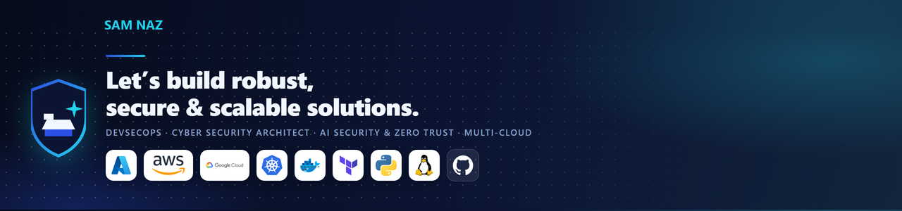

<!--
  GitHub profile README — repo: nazsam/nazsam
  Identity: Sami Naz / Sam Naz / nazsam
  Live profile: https://github.com/nazsam
-->



<table>
<tr>
<td valign="top">

<div align="center">

# Sami Naz

**DevSecOps · Cloud Security · AI & Data Engineering**

[](https://www.linkedin.com/in/samicybersecurity)


<br/>

<a href="https://www.linkedin.com/in/samicybersecurity"></a>
<a href="https://github.com/nazsam"></a>
<a href="mailto:naz2005@gmail.com"></a>


<p>
  <a href="#about-me"></a>
  <a href="#certifications"></a>
  <a href="#core-competencies"></a>
  <a href="#featured"></a>
  <a href="#github-activity"></a>
  <a href="#open-for-collaboration"></a>
</p>

</div>

</td>
<td valign="top" width="240" align="center">

<a id="profile-visitors"></a>

### 👀 Visitors


<br/>

<a href="https://github.com/nazsam?tab=followers"></a>

<br/>

**People**

<!-- PEOPLE:START -->
<p align="center">
  <a href="https://github.com/nazsam" title="nazsam"></a>
</p>
<!-- PEOPLE:END -->

<a href="https://github.com/nazsam/nazsam/issues/new?title=Hi%20from%20a%20profile%20visitor&body=I%20visited%20your%20GitHub%20profile."></a>

</td>
</tr>
</table>

---

<a id="featured"></a>

## Featured

<div align="center">

<a href="https://github.com/nazsam/zero-trust-reference-architecture"></a>
<a href="https://github.com/nazsam/soc-detection-engineering"></a>
<a href="https://github.com/nazsam/agent-security-skills"></a>
<a href="https://github.com/nazsam/ai-security-lab"></a>
<a href="https://github.com/nazsam/security-operations-toolkit"></a>
<a href="https://github.com/nazsam/kubernetes-security-lab"></a>

</div>

---

Crafting **secure, scalable, intelligent systems** across Cybersecurity, Cloud, AI, and Data Engineering.

Multi-disciplinary, multi-cultural experience delivering high-impact solutions for enterprises, startups, and B2B clients.

Committed to building **secure automation**, **AI-powered engineering**, and **Zero-Trust cloud architectures** that stand out in modern tech ecosystems.

> GitHub upload dates are public evidence — not the start of the career. Industry delivery at **Canada Cloud Solution** since **January 2021**. Third-party work is credited in [`ATTRIBUTION.md`](ATTRIBUTION.md).

---


<a id="about-me"></a>

## About Me

I am **Sami Naz** — I build secure, intelligent, automated systems that help organizations scale safely.

My work spans **Cybersecurity, Cloud, AI, and Data Engineering**, which is how I design end-to-end solutions that are both high-performance and high-security. I thrive where innovation meets responsibility: solutions that protect, optimize, and elevate business outcomes.

Since **January 2021** I have led customer-facing work at **Canada Cloud Solution (CCS)** across operations, platform, cloud, cybersecurity, and AI — including public-sector, energy, and manufacturing engagements. Before CCS I was a Cyber Security Architect at **Long View Systems** and an MIS/IT advisor at the **University of Hail**.

```
Secure by Design
Automate by Default
Trust Nothing, Verify Everything
Security. Intelligence. Automation. Impact.
```

**What I ship**

- DevSecOps and CI/CD security guardrails (SAST, SCA, secrets, IaC, containers)
- Zero Trust, IAM, and multi-cloud security (Azure, AWS, GCP)
- SOC/SIEM detection engineering and incident response
- AI / LLM / agent security and secure automation
- Data pipelines, Spark / Databricks workflows, and model tracking with MLflow

---


<a id="certifications"></a>

## Certifications

### Professional

<p>
  
  
  
  
  
  
  
  
  
  
  
</p>

### Cloud, identity, AI & instruction

<p>
  
  
  
  
  
  
  
  
  
  
  
  
</p>

---


<a id="core-competencies"></a>

## Core Competencies

`DevSecOps` `Cloud Security` `Application Security` `Zero Trust` `IAM` `SOC/SIEM` `Secure SDLC` `Threat Modeling` `CI/CD Security` `AI Security` `Data Engineering` `Multi-Cloud Architecture` `Automation` `Infrastructure Systems Analysis` `Cybersecurity Operations`

## 🔗 Connect With Me

<p>
<a href="https://www.linkedin.com/in/samicybersecurity" target="_blank" rel="noreferrer"></a>
&nbsp;
<a href="https://github.com/nazsam" target="_blank" rel="noreferrer"></a>
&nbsp;
<a href="mailto:naz2005@gmail.com"></a>
</p>

**[LinkedIn](https://www.linkedin.com/in/samicybersecurity)** &nbsp;&nbsp; **[GitHub](https://github.com/nazsam)** &nbsp;&nbsp; **[Email](mailto:naz2005@gmail.com)**

## 🛠️ Languages & Tools

<table>
  <tr>
    <td valign="center" width="160"><h3>☁️ Cloud</h3></td>
    <td>
      <a href="https://aws.amazon.com" target="_blank" rel="noreferrer"></a>
      &nbsp;
      <a href="https://cloud.google.com" target="_blank" rel="noreferrer"></a>
      &nbsp;
      <a href="https://azure.microsoft.com" target="_blank" rel="noreferrer"></a>
      <br/>AWS &nbsp;&nbsp; GCP &nbsp;&nbsp; Azure
    </td>
  </tr>
  <tr>
    <td valign="center"><h3>🐳 DevOps</h3></td>
    <td>
      <a href="https://www.docker.com" target="_blank" rel="noreferrer"></a>
      &nbsp;
      <a href="https://kubernetes.io" target="_blank" rel="noreferrer"></a>
      &nbsp;
      <a href="https://www.jenkins.io" target="_blank" rel="noreferrer"></a>
      &nbsp;
      <a href="https://www.terraform.io" target="_blank" rel="noreferrer"></a>
      &nbsp;
      <a href="https://git-scm.com" target="_blank" rel="noreferrer"></a>
      &nbsp;
      <a href="https://www.linux.org" target="_blank" rel="noreferrer"></a>
      <br/>Docker &nbsp; Kubernetes &nbsp; Jenkins &nbsp; Terraform &nbsp; Git &nbsp; Linux
    </td>
  </tr>
  <tr>
    <td valign="center"><h3>🗄️ Databases</h3></td>
    <td>
      <a href="https://www.mysql.com" target="_blank" rel="noreferrer"></a>
      &nbsp;
      <a href="https://www.postgresql.org" target="_blank" rel="noreferrer"></a>
      &nbsp;
      <a href="https://www.mongodb.com" target="_blank" rel="noreferrer"></a>
      &nbsp;
      <a href="https://mariadb.org" target="_blank" rel="noreferrer"></a>
      &nbsp;
      <a href="https://www.oracle.com/database" target="_blank" rel="noreferrer"></a>
      <br/>MySQL &nbsp; PostgreSQL &nbsp; MongoDB &nbsp; MariaDB &nbsp; Oracle
    </td>
  </tr>
  <tr>
    <td valign="center"><h3>💻 Languages</h3></td>
    <td>
      <a href="https://www.python.org" target="_blank" rel="noreferrer"></a>
      &nbsp;
      <a href="https://developer.mozilla.org/en-US/docs/Web/JavaScript" target="_blank" rel="noreferrer"></a>
      &nbsp;
      <a href="https://go.dev" target="_blank" rel="noreferrer"></a>
      &nbsp;
      <a href="https://www.gnu.org/software/bash" target="_blank" rel="noreferrer"></a>
      <br/>Python &nbsp; JavaScript &nbsp; Go &nbsp; Bash
    </td>
  </tr>
</table>

---


<a id="featured-repositories"></a>

## Featured Repositories

Public GitHub under [`nazsam`](https://github.com/nazsam) is hands-on evidence of the work above.

### 🔐 DevSecOps & Cloud Security

<div align="center">
  <a href="https://github.com/nazsam/security-operations-toolkit"></a>
  <a href="https://github.com/nazsam/zero-trust-reference-architecture"></a>
  <a href="https://github.com/nazsam/soc-detection-engineering"></a>
  <a href="https://github.com/nazsam/kubernetes-security-lab"></a>
</div>

| Theme | Repositories |
|---|---|
| Automated CI/CD security guardrails | [security-operations-toolkit](https://github.com/nazsam/security-operations-toolkit) · [devsecops-pipeline-security-gates](https://github.com/nazsam/devsecops-pipeline-security-gates) |
| Zero-Trust IAM | [zero-trust-reference-architecture](https://github.com/nazsam/zero-trust-reference-architecture) · [cloud-iam-least-privilege-toolkit](https://github.com/nazsam/cloud-iam-least-privilege-toolkit) |
| SOC / SIEM detection engineering | [soc-detection-engineering](https://github.com/nazsam/soc-detection-engineering) · [siem-detection-content-library](https://github.com/nazsam/siem-detection-content-library) |
| Cloud security hardening | [cloud-security-baseline](https://github.com/nazsam/cloud-security-baseline) · [aws-security-baseline](https://github.com/nazsam/aws-security-baseline) · [secure-terraform-aws](https://github.com/nazsam/secure-terraform-aws) |

### 🤖 AI & Data Engineering

<div align="center">
  <a href="https://github.com/nazsam/agent-security-skills"></a>
  <a href="https://github.com/nazsam/ai-security-lab"></a>
</div>

| Theme | What you'll find |
|---|---|
| AI agents for cybersecurity | [agent-security-skills](https://github.com/nazsam/agent-security-skills) — defensive skills mapped to ATT&CK, NIST CSF, D3FEND, NIST AI RMF |
| LLM-powered security automation | [ai-security-lab](https://github.com/nazsam/ai-security-lab) — prompt-injection study, STRIDE-for-AI, OWASP LLM / NIST AI RMF |
| Data pipelines & ML ops | Spark · Databricks · MLflow · ETL/ELT patterns in delivery work |

### 🛡️ Application Security

<div align="center">
  <a href="https://github.com/nazsam/threat-modeling-toolkit"></a>
  <a href="https://github.com/nazsam/api-security-testing-framework"></a>
</div>

| Theme | Repositories |
|---|---|
| Threat modeling templates | [threat-modeling-toolkit](https://github.com/nazsam/threat-modeling-toolkit) |
| Secure SDLC automation | [devsecops-pipeline-security-gates](https://github.com/nazsam/devsecops-pipeline-security-gates) · [compliance-as-code](https://github.com/nazsam/compliance-as-code) · [secrets-management-patterns](https://github.com/nazsam/secrets-management-patterns) |
| API security testing | [api-security-testing-framework](https://github.com/nazsam/api-security-testing-framework) · [secure-header-linter](https://github.com/nazsam/secure-header-linter) |

---

<a id="github-activity"></a>

## GitHub Activity

<div align="center">


<br/>


<br/>


</div>

---


<a id="open-for-collaboration"></a>

## Open for Collaboration

If you are building something in **AI, Cybersecurity, Privacy, IAM, Cloud, or Data Engineering**, I love to collaborate.

Let's create something powerful together.

<div align="center">

<a href="https://www.linkedin.com/in/samicybersecurity"></a>
<a href="mailto:naz2005@gmail.com"></a>
<a href="https://github.com/nazsam"></a>

<br/>

**Security. Intelligence. Automation. Impact.**  
That's the engineering philosophy behind every project I build.


</div>
