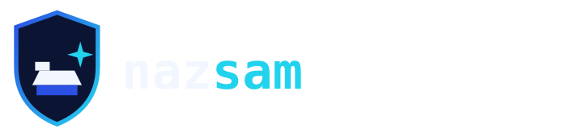

  

# nazsam — Brand Guide

The visual system for the **nazsam** personal brand. Keep it consistent everywhere — GitHub,
LinkedIn, slides, docs — so every touchpoint reads as one identity.

---

## 🎨 Color Palette

| Role | Name | Hex | Use |
|------|------|-----|-----|
| ■ Primary | **Royal Blue** | `#2B50E4` | Primary brand color, accents, links, key UI |
| ■ Accent | **Electric Cyan** | `#22D3EE` | Highlights, the "sam" in the wordmark, sparks |
| ■ Surface (dark) | **Deep Blue** | `#132C5E` | Dark backgrounds, cards, the shield fill |
| ■ Background | **Deep Blue (mid)** | `#1E3A8A` | Gradient midpoint |
| ■ Text (on dark) | **Off-White** | `#F2F7FF` | Body text and wordmark on dark |
| ■ Muted | **Slate** | `#8AA0C6` | Secondary text, captions |

**Signature gradient:** Deep Blue `#132C5E` → `#1E3A8A` → Royal Blue `#2B50E4` (top-left →
bottom-right), with a soft cyan glow in one corner. This replaces the old near-black
`#0B1533`/`#070C1C` panels — same royal-blue-and-cyan identity, just lighter, with no pure
black or near-black surface anywhere.

A small **moon-and-stars** motif (a glowing cyan circle with a thin halo, plus 2–3 sparkle
stars) appears once per banner, upper right, as a recurring signature touch.

### Real brand logos
Where a tool/platform has an official mark (Azure, AWS, GCP, Kubernetes, Docker, Terraform,
Python, Linux, GitHub, LinkedIn, Gmail, etc.), use that mark in its real, official colors —
never recolor a third-party logo to match the palette.

---

## 🔷 Logo

**Concept:** a **shield** (security) forging an **anvil + spark** (the mark).

| File | Use |
|------|-----|
| [`icon.svg`](icon.svg) | Icon-only mark — app tiles, inline |
| [`avatar.svg`](avatar.svg) | Circular mark — GitHub/LinkedIn avatar *(export to PNG to upload)* |
| [`logo-dark.svg`](logo-dark.svg) | Full lockup for **dark** backgrounds |
| [`logo-light.svg`](logo-light.svg) | Full lockup for **light** backgrounds |
| [`wordmark.svg`](wordmark.svg) | Text-only wordmark |
| [`banner.svg`](banner.svg) | Profile / social hero banner |

### Clear space & size
- Keep clear space around the logo equal to the height of the shield's spark.
- Minimum icon size: **24px** (mark stays legible; below that use a solid-fill variant).

### Do ✅
- Use the royal-blue-to-cyan gradient shield on dark; the solid royal-blue shield on light.
- Keep the wordmark lowercase, monospace, with **sam** in the accent cyan color.
- Maintain the palette across all assets — no pure black, no near-black panels.
- Keep real third-party logos in their own official colors.

### Don't ❌
- Don't recolor the wordmark outside the palette.
- Don't stretch, rotate, or add drop shadows/outlines.
- Don't place the dark logo on a busy or low-contrast background.
- Don't recolor an official brand logo (Azure, AWS, GCP, etc.) to match the theme.

---

## 🔤 Typography
- **Wordmark / code:** monospace — `JetBrains Mono`, `Fira Code`, `Consolas` (fallback `monospace`).
- **Headings/body:** clean sans — `Inter`, `Segoe UI`, system UI.
- Wordmark is always **lowercase** and **bold (800)**.

---

## 🗣️ Voice
Confident, precise, honest. Security-leader tone: outcomes over hype, evidence over adjectives.
Tagline: **"Secure by design. Secure the future."**

---

© 2026 nazsam (S. Naz). Logo & assets MIT-licensed within this repository.
