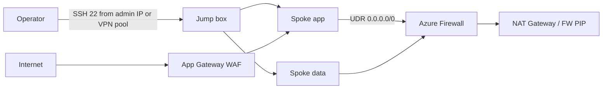

# Architecture

## Address plan

| Network | CIDR | Purpose |
|---|---|---|
| Hub | 10.10.0.0/16 | Shared services, optional firewall, VPN, WAF, jumpbox |
| AzureFirewallSubnet | 10.10.0.0/26 | Required name and minimum size |
| AzureFirewallManagementSubnet | 10.10.0.64/26 | Required for Azure Firewall Basic |
| GatewaySubnet | 10.10.1.0/27 | VPN Gateway only |
| snet-shared | 10.10.2.0/24 | Key Vault / Storage private endpoints, NAT |
| snet-jump | 10.10.3.0/24 | Jump box |
| snet-appgw | 10.10.4.0/24 | Application Gateway |
| Spoke app | 10.20.0.0/16 | App subnet + AKS subnet |
| Spoke data | 10.30.0.0/16 | Data subnet + private endpoints |

Do not overlap these with on-premises or the P2S pool `172.16.201.0/24` used in the P2S lab.

## Routing

- **learn**: spokes use local VNet routing. Hub shared subnet uses NAT Gateway for egress.
- **dev/prod with firewall**: spokes get a UDR `0.0.0.0/0` next hop Azure Firewall. Windows Update FQDNs are allowed in the policy.
- GatewaySubnet is never associated with NAT Gateway.

## Identity

Management groups are **off by default**. Turning them on creates:

```text
Tenant Root
  mg-<prefix>-lab
    mg-<prefix>-platform
    mg-<prefix>-workloads  <-- this subscription
```

You need `Microsoft.Management/managementGroups/write` on Tenant Root Group.

## Traffic flow (prod-like)



## References used while building this lab

- Azure Verified Module pattern for ALZ hub-spoke connectivity
- VPN Gateway SKU consolidation: new gateways use VpnGw*AZ and Standard public IPs
- Virtual network flow logs (NSG flow log create is blocked)
- Azure Firewall Basic requires a management subnet and management PIP
