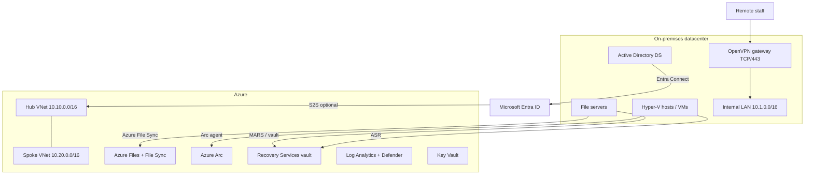

# Hybrid Hyper-V + Azure platform (mid-enterprise case study)

Reference architecture for a mid-size enterprise that keeps a Hyper-V datacenter and extends it into Azure. This is a **presentation-ready design**, not a production cutover. On-prem pieces are documented and scripted; Azure pieces are Terraform.

## Design principles

| Area | Choice | Why |
|---|---|---|
| Identity | AD DS + Entra Connect (sync + PHS or PTA) | Users keep the same UPN on-prem and in Azure |
| Remote access | OpenVPN on a Linux VM in the LAN, TCP 443, split tunnel to `10.1.0.0/16` | Works from hotel Wi-Fi; does not hairpin all internet |
| Cloud governance | Azure Arc on Hyper-V guests and hosts | Inventory, Update Manager, policy, Defender |
| Files | Azure Files + Azure File Sync | Cloud copy, snapshots, Backup |
| DR | Azure Site Recovery for Hyper-V VMs | Orchestrated failover to Azure |
| IaC | Terraform for Azure only | Hyper-V stays scripted with PowerShell |
| Secrets | Key Vault; no passwords in git | Terraform writes secret *names* to outputs |

## Repo map

| Path | Contents |
|---|---|
| [docs/ARCHITECTURE.md](docs/ARCHITECTURE.md) | Full case study |
| [docs/identity-entra-connect.md](docs/identity-entra-connect.md) | Entra Connect runbook |
| [docs/openvpn-lan-access.md](docs/openvpn-lan-access.md) | OpenVPN split-tunnel to the LAN |
| [docs/azure-arc.md](docs/azure-arc.md) | Arc onboarding |
| [docs/backup-dr.md](docs/backup-dr.md) | Backup + ASR |
| [docs/monitoring.md](docs/monitoring.md) | Central logs and security |
| [terraform/](terraform) | Azure hub, vault, files, monitor, Key Vault |
| [scripts/](scripts) | Hyper-V, Arc, OpenVPN, File Sync helpers |
| [diagrams/architecture.mmd](diagrams/architecture.mmd) | Source diagram |

DFS namespace + File Sync details live in [`../dfs-azure-file-sync`](../dfs-azure-file-sync). P2S into Azure (not the LAN) lives in [`../azure-p2s-vpn-lab`](../azure-p2s-vpn-lab).

## Current product notes (checked against Microsoft Learn)

- Entra Connect is still the supported sync engine for hybrid identity. Cloud sync covers a subset of scenarios.
- Azure File Sync supports Windows Server 2025. Cloud tiering must not run on a volume that also hosts DFS-R.
- ASR for Hyper-V uses a Hyper-V site + Provider + Recovery Services agent on each host.
- OpenVPN here is the **on-prem LAN broker**. Azure P2S OpenVPN + Entra ID uses the Azure VPN Client, not community OpenVPN.
